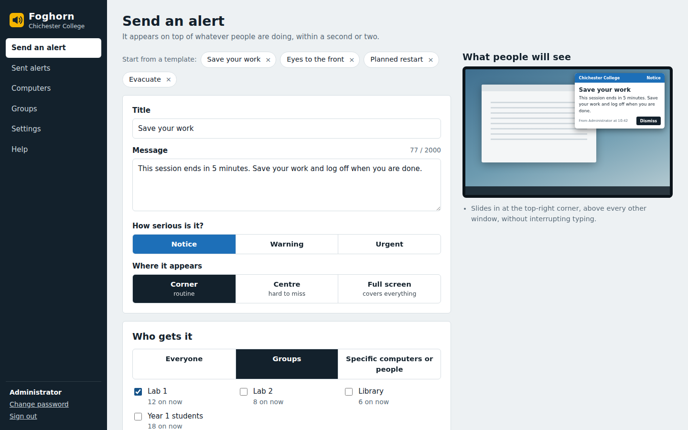

# Foghorn

**Send pop-up alerts to Windows desktops from a web page.**

A member of staff types a message in their browser, picks who should get it
(everyone, a room, an AD group, one PC) and presses **Send alert**. A second or
two later it is on top of whatever those people are doing.



No cloud, no licences, no database. One server program, one small client
program, and clear documentation. Built for schools, colleges and offices on
Active Directory.

| Part | Runs on |
|---|---|
| **Server** + web console | Windows Server 2016+ / Windows 10–11, **or** 64-bit Linux with systemd |
| **Desktop client** | Windows 10 and 11 (the PCs that receive alerts) |
| **Web console** | Any modern browser, on any device |

---

## Features

- **Three styles**, so alerts fit their purpose:
  - *Corner* — a card at the top-right, above other windows, without stealing the keyboard.
  - *Centre* — the same card, larger, in the middle of the screen.
  - *Full screen* — covers every monitor. For emergencies and "eyes to the front".
- **Targeting** by computer name, logged-on user, AD organisational unit, AD group, or IP subnet. Saved groups (typically rooms) for one-click reuse.
- **Acknowledgement tracking.** Ask people to confirm they read it, and see who did.
- **Recall** — take an alert off every screen still showing it.
- **Live delivery view.** Watch, per computer, who has displayed and confirmed each alert.
- **Templates** for wording you reuse. Wording only — audience is always a deliberate choice.
- **Roles.** *Administrators* manage everything. *Senders* can send alerts, optionally limited to their own groups (a tutor to their own classroom, say). Every alert is signed with the sender's name.
- **API tokens** for scripts and monitoring systems.
- **Small.** About 40 MB of memory on the server with 1,500 PCs connected. The client is a 64 KB `.exe` and needs nothing installed on Windows 10 or 11.
- **Standard deployment.** Roll the client out with an MSI + transform through Group Policy Software Installation, Intune, SCCM, PDQ, or a start-up script.
- **No internet needed.** Console uses system fonts only. No CDN, no telemetry, no external calls.
- **HTTPS** with your own certificate. Cross-site request forgery and login lock-out are built in. Passwords are PBKDF2-SHA256 (210,000 rounds).

## Quick start (about 10 minutes)

You need a machine that stays on (a Windows server or spare PC, or a Linux
server — Foghorn uses very little of it) and one Windows test PC. The steps
below are for a Windows server; on Linux, do
[Running the server on Linux](#running-the-server-on-linux) instead of step 1,
then carry on from step 2.

**1. Install the server.** Copy this whole folder to the server. Open
PowerShell **as administrator**, go to the `deploy` folder and run:

```powershell
powershell -ExecutionPolicy Bypass -File .\Install-FoghornServer.ps1
```

It prints the console address, a temporary password and the **client key** —
copy them for the next few minutes.

**2. Sign in.** On any PC, open `http://YOUR-SERVER:8080/`, sign in as `admin`
with the temporary password, choose your own. Under **Settings** set your
organisation name.

**3. Try it on one PC by hand.** Copy `dist\FoghornClient.exe`,
`deploy\Install-FoghornClient.cmd` and `deploy\Install-FoghornClient.ps1` into
one folder on a test PC. From an **administrator** command prompt in that
folder:

```bat
Install-FoghornClient.cmd -ServerUrl http://YOUR-SERVER:8080 -ClientKey PASTE-THE-KEY
```

Log on as a normal user. The PC appears in **Computers** with a green dot
within a few seconds. Go to **Send an alert** and send yourself one.

**4. Roll it out to every PC.** Follow
[docs/DEPLOY-CLIENTS.md](docs/DEPLOY-CLIENTS.md) — the recommended path is an
**MSI + transform** deployed with Group Policy Software Installation.

> Want to see what alerts look like before installing anything? Open a command
> prompt in the `dist` folder on any Windows PC and run
> `FoghornClient.exe --test`. It shows one of each style without needing a
> server.

## Running the server on Linux

The server is a single static binary with no dependencies; a systemd unit is
included. On any 64-bit Linux with systemd (Ubuntu, Debian, RHEL/Rocky/Alma…),
from this folder:

```bash
sudo useradd --system --home-dir /var/lib/foghorn --shell /usr/sbin/nologin foghorn
sudo install -m 0755 dist/foghorn-server-linux-amd64 /usr/local/bin/foghorn-server
sudo install -m 0644 deploy/linux/foghorn.service /etc/systemd/system/foghorn.service
sudo systemctl daemon-reload
sudo systemctl enable --now foghorn
sudo cat /var/lib/foghorn/FIRST-RUN.txt      # temporary admin password + client key
sudo ufw allow 8080/tcp                       # or: firewall-cmd --permanent --add-port=8080/tcp && firewall-cmd --reload
```

Then continue from step 2 of the quick start. Good to know:

- **Only the server runs on Linux.** The desktop client is Windows-only; the PCs do not care what the server runs on, and AD targeting still works because the clients report their own OU and groups.
- The service runs as the unprivileged `foghorn` account in a systemd sandbox that can write only to **`/var/lib/foghorn`**. Data, `config.json` and `foghorn.log` all live there — back up that folder.
- The bundled binary is **x86-64 only**. For ARM, build from source (see [docs/BUILDING.md](docs/BUILDING.md)).
- When running `foghorn-server` by hand (e.g. `reset-password`), always pass `-data /var/lib/foghorn` and run it as the `foghorn` user. The `service …` commands are Windows-only — use `systemctl`.
- Ports below 1024 (e.g. 443) need `CAP_NET_BIND_SERVICE` or a reverse proxy.

HTTPS, reverse proxies, upgrading, password resets, moving between Windows and
Linux, and removal are all covered in
**[docs/INSTALL-SERVER.md — Appendix A](docs/INSTALL-SERVER.md#appendix-a-installing-on-linux)**.

## How it fits together

```
   Staff browser                     Foghorn server                   Windows PCs
 ┌───────────────┐   http(s)     ┌────────────────────┐  http(s)  ┌──────────────────┐
 │  Web console  │ ───────────▶  │  foghorn-server    │ ◀──────── │ FoghornClient.exe│
 │  (any device) │               │  Windows service   │  each PC  │ runs as the      │
 └───────────────┘               │  or systemd, :8080 │  keeps a  │ logged-on user,  │
                                 │  data: one folder  │  request  │ no window until  │
                                 └────────────────────┘  open     │ an alert arrives │
                                                                  └──────────────────┘
```

- **Clients connect out to the server.** Nothing listens on the PCs, so there are no firewall changes on them.
- Each client tells the server its computer name, logged-on user, the computer's OU and the user's AD groups. That is how targeting works — the server never talks to a domain controller directly.
- All data is JSON files in one folder — `C:\ProgramData\Foghorn` on Windows, `/var/lib/foghorn` on Linux. Backing up is copying that folder.

## What is in this folder

| Folder / file | What it is |
|---|---|
| `dist\foghorn-server.exe` | The server, ready to run (Windows x64). Includes the web console. |
| `dist\FoghornClient.exe` | The desktop client, ready to deploy. Needs nothing installed on Windows 10 or 11. |
| `dist\FoghornClient.msi` | The client as an MSI. Ship generic; pair with a transform (below) for deployment. |
| `dist\foghorn-server-linux-amd64` | The server for Linux (x86-64, static, no dependencies). See [Running the server on Linux](#running-the-server-on-linux). |
| `dist\SHA256SUMS.txt` | Checksums of the four binaries. |
| `deploy\` | Install and uninstall scripts, the MSI source, build script and transform generator (`deploy\msi\`), the ADMX Group Policy template, the systemd unit (`deploy\linux\`). |
| `docs\` | Full documentation — the guides below. |
| `server\`, `client\` | Source code (Go for the server, C# for the client). |

## Documentation

| Read this | When |
|---|---|
| **[docs/INSTALL-SERVER.md](docs/INSTALL-SERVER.md)** | Installing, moving, upgrading, backing up, removing the server on Windows — and on Linux (Appendix A). HTTPS. |
| **[docs/DEPLOY-CLIENTS.md](docs/DEPLOY-CLIENTS.md)** | Getting the client onto every PC — MSI + transform through Group Policy, or a start-up script. |
| **[docs/USER-GUIDE.md](docs/USER-GUIDE.md)** | For the staff who will send alerts. Safe to hand out as it is. |
| **[docs/SECURITY.md](docs/SECURITY.md)** | What is protected, what is not, and how to tighten it. Read before going live. |
| **[docs/TROUBLESHOOTING.md](docs/TROUBLESHOOTING.md)** | Something is not working. Organised by symptom. |
| **[docs/API.md](docs/API.md)** | Sending alerts from scripts, monitoring systems, or other tools. |
| **[docs/BUILDING.md](docs/BUILDING.md)** | Rebuilding from source. Renaming the product. |
| **[CHANGELOG.md](CHANGELOG.md)** | What changed and when. |

## Building from source

```bash
# Server (needs Go 1.22+)
cd server && go test ./... && CGO_ENABLED=0 go build -mod=vendor -trimpath -buildvcs=false -ldflags "-s -w" -o ../dist/foghorn-server.exe .

# Server for Linux (from any OS)
cd server && GOOS=linux GOARCH=amd64 CGO_ENABLED=0 go build -mod=vendor -trimpath -buildvcs=false -ldflags "-s -w" -o ../dist/foghorn-server-linux-amd64 .

# Client (on Windows, uses the C# compiler that ships with Windows itself)
cd client && build.cmd

# Client MSI (on Linux, needs the wixl and msitools packages)
deploy/msi/build-msi.sh
```

Full details, including cross-compiling and rebuilding the MSI, in
[docs/BUILDING.md](docs/BUILDING.md).

## Contributing

Contributions and bug reports are welcome. See
[CONTRIBUTING.md](CONTRIBUTING.md) for how to file issues, open pull requests,
and the coding conventions the project follows.

## Author

Foghorn was designed and built by **Archie Paice** — the server, the desktop
client, the web console, the MSI and transform tooling, the Group Policy
template and the documentation.

Contact: <hello@archiepaice.com>

## Licence

MIT — Copyright (c) 2026 Archie Paice. See [LICENSE](LICENSE). The server
bundles `golang.org/x/sys` (BSD-3-Clause; licence in
`server/vendor/golang.org/x/sys/LICENSE`).
